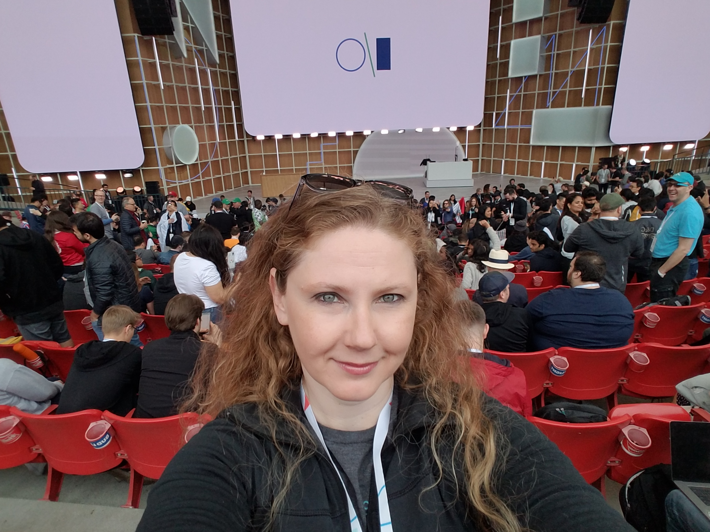

# Android Summer Bootcamp 2020

## Profile

* **Name**: Jennifer Bailey
* **Discord Username**: Jenn
* **Location**: Colorado, USA

I am a freelance Android and iOS developer as well as a full-time computer science professor for Aims Community College in Colorado where I teach a certificate in mobile app development including Android and iOS platforms. I also teach courses in Python, Java, C++ and a certificate for development in the .NET platform utilizing C#. Prior to teaching, I was a full-time software engineer creating .NET applications in C# for a financial industry. I am also a writer and an organizer for the Google Developer Group of Northern Colorado. I enjoy attending the Google I/O conference as well as various Android meetups and conferences around the United States. In my spare time, I enjoy rollerblading, horseback riding and spending time with my teenage daughter and two dogs.

 
